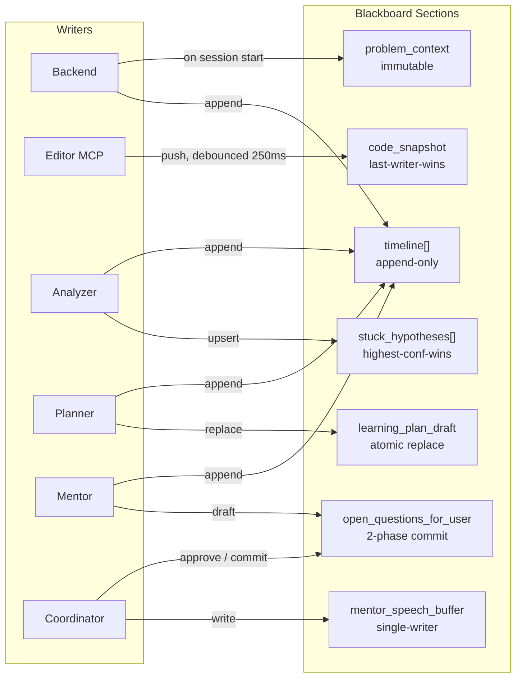
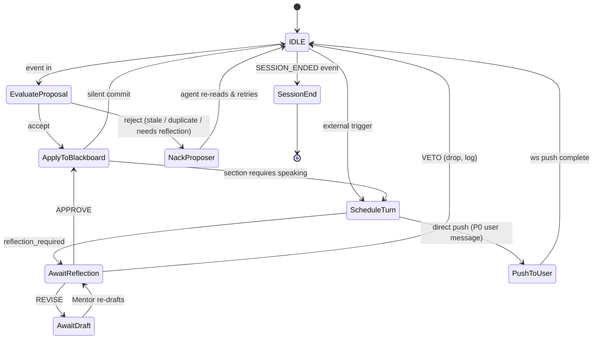
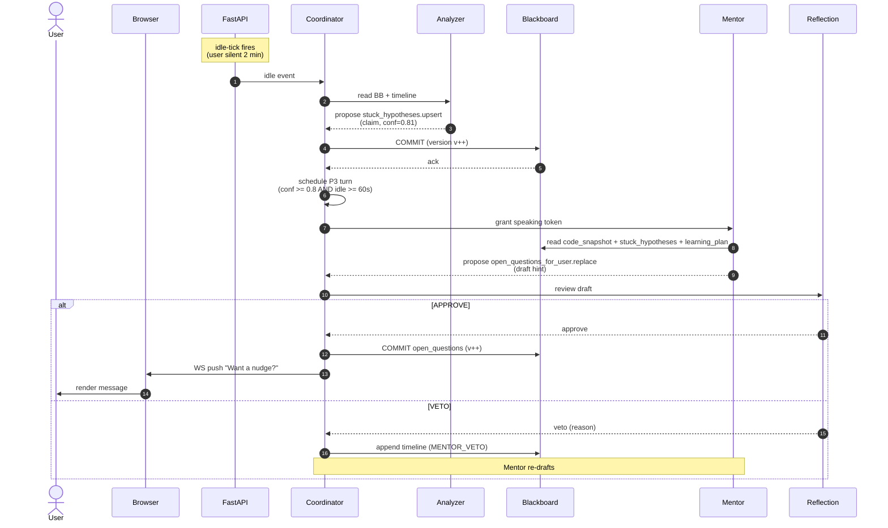
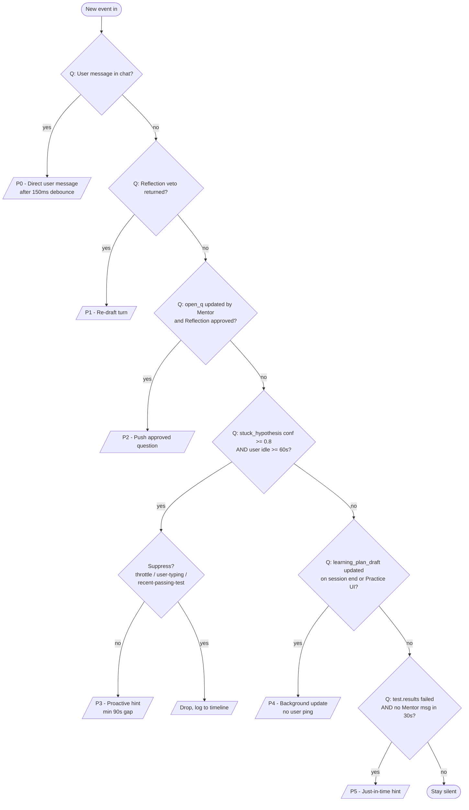

# Workflow Architecture — Architecture C (Blackboard + Coordinator)

> Companion to `AGENT_ARCHITECTURE.md` Section 3. This document zooms in on **how** the blackboard + coordinator pattern runs end-to-end during a real coding session: lifecycle, message sequences, state machines, conflict resolution, latency budget, error paths, and the failure modes you need to design against.
>
> **Also available in Chinese:** [`WORKFLOW_ARCHITECTURE_C_中文版.md`](./WORKFLOW_ARCHITECTURE_C_中文版.md) — same content, restructured for readability, with six Mermaid diagrams. Good for design reviews and team discussions.

---

## 1. The Big Picture in One Picture

```
                     ┌────────────────────────────────────┐
                     │            USER (browser)          │
                     │  [ Editor ]            [ Chat ]    │
                     └──────┬─────────────────────┬───────┘
                            │ WS / SSE            │ WS / SSE
                            ▼                     ▲
                  ┌──────────────────────────────────────┐
                  │   FastAPI Gateway                    │
                  │   • auth, rate-limit, session-WS     │
                  │   • thin: routes events to/from bus  │
                  └──────┬───────────────────────────────┘
                         │
                         ▼
              ╔══════════════════════════════╗
              ║       COORDINATOR (C)        ║   ┌──────────────────┐
              ║  state machine • scheduler   ║◀──│ REFLECTION/CRITIC│
              ║  conflict policy • tokens    ║   │ (read-only, veto)│
              ╚════╤══════════╤══════════╤════╝   └──────────────────┘
                   │          │          │
        propose/   │ propose/ │ propose/ │  read+write
        read       │ read     │ read     │
                   ▼          ▼          ▼
              ┌────────┐ ┌────────┐ ┌────────┐
              │MENTOR  │ │ANALYZER│ │TEACHER │
              └───┬────┘ └───┬────┘ └───┬────┘
                  │          │          │
                  └─────┬────┴────┬─────┘
                        ▼         ▼
                  ┌──────────────────────┐
                  │      BLACKBOARD      │  (Postgres JSONB / Redis)
                  │  • problem_context   │   per-session, versioned
                  │  • code_snapshot     │   sections, append-only
                  │  • timeline[]        │   timeline, proposal log
                  │  • stuck_hypotheses[]│
                  │  • learning_plan     │
                  │  • open_questions    │
                  └──────────────────────┘
                              │
                              ▼
                  ┌──────────────────────┐
                  │   MCP Tool Layer     │  problems / execution /
                  │   (read-only here)   │  user / editor / curriculum
                  └──────────────────────┘
```

The blackboard is the **single source of truth** for "what is happening right now in this session." Every agent is a loop: *read → think → propose → wait for turn*.

### 1.1 Mermaid Version (GitHub / VSCode renderable)

If you prefer a renderable diagram (for READMEs, design reviews, or the GitHub wiki), here is the same architecture in Mermaid.

#### 1.1.1 System-Level View (components + data flow)

```mermaid
flowchart TB
    %% External actors
    User([User in browser])
    Editor[Editor MCP]
    ExecMCP[Execution MCP]

    %% Gateway
    Gateway[/FastAPI Gateway<br/>auth, rate-limit, WS/]

    %% Core
    Coordinator{{"Coordinator<br/>(state machine)"}}
    Reflection{{"Reflection / Critic<br/>(read-only)"}}

    Mentor[/"Mentor<br/>(writer + reader)"/]
    Analyzer[/"Analyzer<br/>(writer + reader)"/]
    Planner[/"Planner<br/>(writer + reader)"/]

    %% Blackboard sub-graph
    subgraph Blackboard["BLACKBOARD (per session, versioned)"]
        BB_Ctx["problem_context<br/>(immutable)"]
        BB_Code["code_snapshot"]
        BB_Time["timeline[]<br/>(append-only)"]
        BB_Stuck["stuck_hypotheses[]"]
        BB_Plan["learning_plan_draft"]
        BB_Open["open_questions_for_user"]
        BB_Speech["mentor_speech_buffer"]
    end

    %% MCP
    MCP[("MCP Tool Layer<br/>problems / execution /<br/>user / editor / curriculum")]

    %% Edges
    User <-->|WS events / chat| Gateway
    Editor -->|code.events| Gateway
    ExecMCP -->|test.results| Gateway

    Gateway -->|publish events| BB_Time
    Gateway -->|push code| BB_Code

    Mentor <-->|propose / read| Coordinator
    Analyzer <-->|propose / read| Coordinator
    Planner <-->|propose / read| Coordinator

    Coordinator -->|grant speaking token| Mentor
    Coordinator <-->|veto / approve| Reflection

    Mentor -->|propose open_q| Coordinator
    Coordinator -->|commit| BB_Open
    Coordinator -->|commit| BB_Stuck
    Coordinator -->|commit| BB_Plan

    Mentor -. read .-> BB_Time
    Analyzer -. read .-> BB_Time
    Planner -. read .-> BB_Time

    Mentor <-->|read / call| MCP
    Analyzer <-->|read / call| MCP
    Planner <-->|read / call| MCP

    Coordinator -->|broadcast version bump| Mentor
    Coordinator -->|broadcast version bump| Analyzer
    Coordinator -->|broadcast version bump| Planner

    Gateway -->|push to user| User

    %% Styling
    classDef agent fill:#1f6feb,stroke:#0b3d91,color:#fff
    classDef coord fill:#d29922,stroke:#7d5a00,color:#000
    classDef store fill:#238636,stroke:#0a3d1c,color:#fff
    classDef io fill:#6e7681,stroke:#3a3f47,color:#fff
    classDef external fill:#8957e5,stroke:#5a3a9c,color:#fff

    class Mentor,Analyzer,Planner agent
    class Coordinator,Reflection coord
    class BB_Ctx,BB_Code,BB_Time,BB_Stuck,BB_Plan,BB_Open,BB_Speech store
    class Gateway,MCP io
    class User,Editor,ExecMCP external
```



#### 1.1.2 Blackboard Sections (write-policy view)



#### 1.1.3 Coordinator State Machine



#### 1.1.4 Sequence: "User is stuck for 2 minutes"



#### 1.1.5 Token-Priority Flow (P0–P5)



#### 1.1.6 How to Read These Diagrams

| Diagram | Best for |
|---|---|
| 1.1.1 (system view) | Architecture reviews, READMEs, design wikis |
| 1.1.2 (write policies) | Showing "who can edit what" in code review |
| 1.1.3 (state machine) | Debugging Coordinator behavior |
| 1.1.4 (sequence) | Walking through a specific user scenario |
| 1.1.5 (token priority) | Understanding the suppression rules |

All six render natively in **GitHub**, **GitLab**, **VSCode** (with the Mermaid extension), **Obsidian**, and **Notion**. No external tooling required.

---

## 2. The Blackboard: Sections, Versions, and Ownership

The blackboard is a per-session, versioned, sectioned document. Every write produces a new version of that section; readers always see the latest committed version plus any sections they have explicit access to.

### 2.1 Section Catalog (with write policies)

| Section | Shape | Writers | Readers | Write Policy |
|---|---|---|---|---|
| `problem_context` | `{id, title, statement, examples, constraints, tags[]}` | Backend (on session start) | All | **Immutable** after session start |
| `code_snapshot` | `{language, content, cursor, last_edited_at}` | Editor MCP (push) | All | **Last-writer-wins**, debounced 250 ms |
| `timeline[]` | append-only array of `TimelineEvent` | All (only appends) | All | **Append-only**, no overwrite |
| `stuck_hypotheses[]` | array of `{claim, confidence, evidence[], author, ts, status}` | Analyzer | Mentor, Coordinator, Reflection | **Highest-confidence-wins**; older claims marked `superseded` |
| `learning_plan_draft` | `{weak_topics[], next_problems[], concept_review[], version}` | Planner | Coordinator, Mentor | **Whole-section replace** (atomic) |
| `open_questions_for_user` | `{questions[], awaiting_user_response_to, draft_by, reviewed_by}` | Mentor (writes), Reflection (vetoes) | Front-end, Mentor | **Two-phase commit** — Mentor drafts, Reflection approves |
| `mentor_speech_buffer` | `{pending, last_pushed, suppressed_count}` | Coordinator (writes) | Mentor | **Single-writer** — only Coordinator |

### 2.2 Versioning

Every section carries a monotonically increasing `version` per session. Coordinated writes are **optimistic** — agents propose a write with a base version; if the base is stale, the proposal is rejected and the agent re-reads.

```jsonc
// Example: blackboard state at session v_total = 47
{
  "session_id": "sess_abc",
  "version": 47,
  "sections": {
    "problem_context":  { "v": 1,  "data": { /* immutable */ } },
    "code_snapshot":    { "v": 42, "data": { "language": "python", ... } },
    "timeline":         { "v": 47, "data": [ /* 47 events */ ] },
    "stuck_hypotheses": { "v": 7,  "data": [
        { "id": "h3", "claim": "off-by-one in right pointer", "confidence": 0.81, "status": "active" },
        { "id": "h2", "claim": "missing base case",         "confidence": 0.42, "status": "superseded" }
    ]},
    "learning_plan_draft": { "v": 2, "data": { /* ... */ } },
    "open_questions_for_user": { "v": 0, "data": { "questions": [] } },
    "mentor_speech_buffer": { "v": 11, "data": { "pending": null, "suppressed_count": 0 } }
  }
}
```

### 2.3 The Append-Only Timeline

The timeline is special: **every** event from any source is appended here. It is the audit trail.

```jsonc
{
  "ts": "2026-06-14T15:32:11.482Z",
  "actor": "analyzer",     // user | mentor | analyzer | teacher | coordinator | reflection | editor
  "kind": "HYPOTHESIS_PROPOSED",
  "ref": "stuck_hypotheses#h3",
  "summary": "off-by-one in right pointer (conf 0.81)",
  "data": { /* full payload */ }
}
```

This single structure is what makes the system **explainable** and **replayable** — see §7.

---

## 3. The Coordinator: State Machine

The Coordinator is a small, deterministic state machine. It does not use an LLM. Its job is to:

1. Accept or reject agent proposals against the section's write policy.
2. Schedule **speaking tokens** so only one agent talks to the user at a time.
3. Suppress stale or contradictory Mentor output.

### 3.1 State Variables

```text
state.coordinator {
  speaking_token:        AgentId | null       // who is allowed to push to user
  token_queue:           list[AgentId]         // waiters in priority order
  last_user_activity_at: datetime
  last_mentor_message_at:datetime
  in_flight_proposals:   map[ProposalId, Proposal]
  suppression_rules:     list[SuppressionRule] // e.g., "drop if user just submitted"
  reflection_required:   bool
}
```

### 3.2 States

```
                ┌────────────────┐
                │     IDLE       │◀────────────────────────────┐
                │ (no pending    │                             │
                │  proposals,    │                             │
                │  no token)     │                             │
                └───────┬────────┘                             │
                        │ on event                             │
                        ▼                                      │
        ┌────────────────────────────────┐                     │
        │      EVALUATE_PROPOSAL         │                     │
        │  • apply section write policy  │                     │
        │  • check for staleness         │                     │
        └──────┬──────────────┬──────────┘                     │
       accept  │              │ reject                         │
               ▼              ▼                                │
   ┌──────────────────┐  ┌──────────────────┐                   │
   │ APPLY_TO_BLACK   │  │ NACK_PROPOSER    │ ──rebase & retry──┘
   │ (commit version) │  │ (with reason)    │
   └────────┬─────────┘  └──────────────────┘
            │
            │ if proposal creates a need to speak
            ▼
   ┌──────────────────┐
   │  SCHEDULE_TURN   │  priority = f(section, confidence, age)
   │  (grant token)   │  throttled by min-gap rule
   └────────┬─────────┘
            │
            ▼
   ┌──────────────────┐
   │  AWAIT_REFLECTION│  (only if reflection_required)
   └────┬───────┬─────┘
   ok   │       │ veto → loop back to AWAIT_DRAFT
        ▼
   ┌──────────────────┐
   │  PUSH_TO_USER    │  → emit to WebSocket
   └────────┬─────────┘
            │
            └─────── on session lifecycle event ────▶ SESSION_END
```

### 3.3 Token Priority

The Coordinator hands out speaking tokens in this priority order (highest first):

| Priority | Source | When granted |
|---|---|---|
| P0 | Direct user message in chat | Always, after debounce 150 ms |
| P1 | Reflection veto returned | If Mentor re-draft needed |
| P2 | `open_questions_for_user` updated by Mentor | When Reflection approves |
| P3 | `stuck_hypotheses` committed with conf ≥ 0.8 *and* user idle ≥ 60 s | Throttled: min 90 s between Mentor proactive messages |
| P4 | `learning_plan_draft` updated | Only on session-end or "Practice" UI open |
| P5 | `test.results` failed (just-in-time hint) | Only if no Mentor msg in last 30 s |

A P3 token is **suppressed** if any of:
- User submitted passing tests in the last 15 s
- User is actively typing (keystroke in last 5 s)
- A P0 turn is queued
- Another P3 was pushed less than 90 s ago

---

## 4. The Proposal Protocol (Wire Format)

Every agent-to-blackboard write is a **proposal**, not a direct write. The Coordinator validates and commits.

### 4.1 Proposal Envelope

```jsonc
{
  "proposal_id":   "p_8f3a",                       // unique
  "session_id":    "sess_abc",
  "from":          "analyzer",                     // proposer
  "section":       "stuck_hypotheses",             // target section
  "base_version":  6,                              // version proposer read
  "operation":     "upsert" | "append" | "replace",
  "payload": {
    "id": "h3",
    "claim": "off-by-one in right pointer",
    "confidence": 0.81,
    "evidence": ["edit_cluster@ln 14-18 × 6", "test_results[7,9] failed on right-edge"]
  },
  "rationale":     "user reverts 6 times in 90 s on the same hunk",
  "ts":            "2026-06-14T15:32:11.482Z"
}
```

### 4.2 Coordinator Decision Logic (pseudocode)

```python
def evaluate(proposal: Proposal) -> Decision:
    section = proposal.section
    current = blackboard.sections[section].version
    policy  = SECTION_POLICIES[section]

    # 1. Staleness check
    if proposal.base_version != current and policy.requires_strict_versioning:
        return Decision.NACK_REBASE

    # 2. Section-specific rules
    if section == "stuck_hypotheses":
        if any(h.confidence >= proposal.payload.confidence and h.status == "active"
               for h in blackboard.sections["stuck_hypotheses"].data):
            # Lower-or-equal confidence new claim: mark as "candidate" instead
            proposal.payload.status = "candidate"
        if any(h.claim == proposal.payload.claim for h in blackboard.sections["stuck_hypotheses"].data):
            return Decision.NACK_DUPLICATE

    if section == "open_questions_for_user":
        if not coordinator.reflection_required_ok_for(proposal):
            return Decision.NACK_NEEDS_REFLECTION

    if section == "code_snapshot":
        # Debounce: collapse within 250ms
        if now() - blackboard.sections["code_snapshot"].data.last_edited_at < 250:
            blackboard.sections["code_snapshot"] = proposal.payload
            return Decision.COMMIT_DEBOUNCED

    return Decision.COMMIT
```

### 4.3 Two-Phase Commit for User-Facing Output

`open_questions_for_user` is the only section that can be **vetoed** by Reflection. The protocol:

```
MENTOR  ──propose(draft)──▶  COORDINATOR
                                  │
                                  ▼
                            REFLECTION
                                  │
                  ┌───────────────┼───────────────┐
                  ▼               ▼               ▼
               APPROVE         REVISE          VETO
                  │               │               │
                  ▼               ▼               ▼
              COMMIT         send back to     drop, log reason
                            MENTOR (re-draft)  to timeline
```

Veto reasons are stored in the timeline so the system is auditable:
- `non-spoiler-violation`
- `unsafe-content`
- `redundant-with-recent-message`
- `low-confidence-hypothesis`

---

## 5. End-to-End Session Lifecycle

A full session has five phases. Below is the canonical happy path; edge cases follow in §6.

### 5.1 Phase Overview

```
┌────────┐   ┌──────────┐   ┌──────────┐   ┌──────────┐   ┌────────┐
│ START  │──▶│  READ    │──▶│  SOLVE   │──▶│ REVIEW   │──▶│  END   │
└────────┘   └──────────┘   └──────────┘   └──────────┘   └────────┘
   ~1s          5–30s         5–60 min       30–90 s          ~2s
```

### 5.2 Phase 1 — Session Start

```text
1. User clicks "Start Problem #42" in the browser.
2. FastAPI gateway:
     a. creates session row in Postgres (session_id, user_id, problem_id, started_at)
     b. seeds blackboard:
          problem_context  ← problems-mcp.get_problem(42)
          code_snapshot    ← {language: "python", content: starter}
          timeline[0]      ← {actor: backend, kind: SESSION_STARTED}
     c. loads L3 profile: mastery_map, recent_stuck_reports[], preferred_tone
     d. opens WebSocket to user
3. Coordinator initializes:
     speaking_token = null
     last_user_activity_at = now()
     reflection_required = true
4. Mentor receives a P2 token, drafts a greeting grounded in the problem + profile.
5. Reflection approves → push to user.
6. Timeline appended: SESSION_STARTED, MENTOR_GREETING_PUSHED.
```

### 5.3 Phase 2 — Read / Explore

User is reading the problem, scrolling examples, maybe running a quick mental simulation. No code edits yet.

```text
Loop while user is in "read mode" (no edits for >5 s):
  - Editor MCP pushes cursor moves and selection changes → timeline
  - Analyzer stays quiet (no StuckReport yet)
  - Mentor is silent (P0 only)
  - Planner may pre-compute a candidate learning_plan_draft using
    user.mcp.get_user_profile(user_id), but does not write yet.
```

### 5.4 Phase 3 — Solve (the long phase)

This is where the architecture earns its keep. The flow repeats a tight loop:

```text
For each user action (keystroke, paste, run-tests, chat-msg, idle-tick):
  1. Editor MCP debounces code edits → blackboard.code_snapshot (v++)
  2. execution MCP on test run → blackboard.timeline (kind: TEST_RUN)
  3. Coordinator fans out the event to subscribers:
       - Analyzer: re-evaluates stuckness from new timeline slice
       - Planner: lazily re-ranks weak topics if the new evidence shifts things
       - Mentor: does nothing (awaits a token)

When Analyzer decides a new stuck_hypothesis is warranted:
  Analyzer → Coordinator (proposal: stuck_hypotheses.upsert)
  Coordinator → policy check → COMMIT (v++)
  Coordinator → if conf ≥ 0.8 AND user idle ≥ 60 s AND not throttled:
                  grant Mentor P3 token
                else:
                  keep the hypothesis in blackboard; wait for next event

When Mentor has the token:
  Mentor reads:  code_snapshot + stuck_hypotheses.active + learning_plan_draft
  Mentor drafts: a short, grounded hint or clarifying question
  Mentor → Coordinator (proposal: open_questions_for_user.replace)
  Coordinator → Reflection
  Reflection:
    - APPROVE  → COMMIT, push to user WS, timeline += MENTOR_QUESTION_PUSHED
    - REVISE   → send to Mentor with notes (e.g., "more specific, point to line 18")
    - VETO     → drop, log reason

When user replies in chat:
  FastAPI → Coordinator (chat.message from user)
  Coordinator → Mentor P0 token (highest priority)
  Mentor → reads timeline + blackboard → drafts reply
  Coordinator → Reflection → push.
```

### 5.5 Phase 4 — Review (on submission)

```text
1. User submits. execution-mcp returns full test result.
2. FastAPI appends SUBMISSION_RECEIVED to timeline.
3. Coordinator grants a Mentor P0 token (user explicitly asked for feedback).
4. Mentor reads timeline + final code + test result.
5. Mentor produces a two-paragraph review:
     (a) what worked
     (b) one concrete thing to improve next time, grounded in the hypothesis log
6. Planner is granted a P4 turn (background, no user ping):
     - reads full session timeline
     - updates learning_plan_draft
7. Reflection approves both → push review to user; update profile mastery deltas.
8. Front-end shows "Practice these next" card from learning_plan_draft.
```

### 5.6 Phase 5 — Session End

```text
1. User closes the tab OR explicit "End session" click OR idle > 30 min.
2. Coordinator emits SESSION_ENDED to timeline.
3. Planner finalizes learning_plan_draft (atomic replace).
4. user-mcp.update_mastery(...) is called for each affected topic.
5. Blackboard is archived to cold storage (Postgres) for replay.
6. WebSocket closed.
```

---

## 6. Canonical Sequence Diagram — "User stuck for 2 minutes"

The single most important flow to internalize.

```
User        Browser       FastAPI      Coordinator   Analyzer   Mentor     Reflection   Blackboard
 │             │             │              │            │          │            │             │
 │  (idle)     │             │              │            │          │            │             │
 │             │             │             │             │          │            │             │
 │             │             │ idle-tick   │             │          │            │             │
 │             │             │─────────────▶             │          │            │             │
 │             │             │             │  read BB    │          │            │             │
 │             │             │             │─────────────┼─────────▶│            │             │
 │             │             │             │             │          │            │             │
 │             │             │             │  propose    │          │            │             │
 │             │             │             │◀────────────┼──────────│  stuck_h   │             │
 │             │             │             │             │          │  .upsert   │             │
 │             │             │             │  COMMIT     │          │            │             │
 │             │             │             │─────────────────────────────────────────────────▶  v++
 │             │             │             │             │          │            │             │
 │             │             │             │  schedule P3 turn       │            │             │
 │             │             │             │─────────────▶  token    │            │             │
 │             │             │             │             │          │            │             │
 │             │             │             │  read BB    │          │            │             │
 │             │             │             │─────────────────────────▶            │             │
 │             │             │             │             │          │            │             │
 │             │             │             │  propose    │          │            │             │
 │             │             │             │◀─────────────────────────│  open_q   │             │
 │             │             │             │             │          │  .replace  │             │
 │             │             │             │  REFLECT    │          │            │             │
 │             │             │             │─────────────────────────┼──────────▶             │
 │             │             │             │             │          │            │             │
 │             │             │             │  APPROVE    │          │            │             │
 │             │             │             │◀────────────────────────┼────────────│             │
 │             │             │             │             │          │            │             │
 │             │             │             │  COMMIT     │          │            │             │
 │             │             │             │─────────────────────────────────────────────────▶  v++
 │             │             │             │             │          │            │             │
 │             │  WS push    │             │             │          │            │             │
 │◀────────────┼─────────────│             │             │          │            │             │
 │  "Want a    │             │             │             │          │            │             │
 │   nudge?"   │             │             │             │          │            │             │
```

End-to-end target latency for this proactive flow: **≤ 1.5 s** from "idle-tick fires" to "user sees message." See §9 for the budget breakdown.

---

## 7. Replayability — Why the Timeline Is Gold

Because every event lands in the timeline and every blackboard section is versioned, you can:

1. **Reproduce a Mentor decision.** Given timeline + blackboard snapshot at time T, ask: "What would Mentor have said?" Re-run with no LLM, with a different LLM, or with a different Reflection policy.

2. **Diff two sessions.** "On problem #42, users who got the stuck_hypothesis 'off-by-one in right pointer' (conf 0.81) within 90 s were 2.3× more likely to pass on their next attempt." This is *the* analytics primitive.

3. **A/B test policies.** Swap the Coordinator's priority function, replay the historical timelines through a stub Coordinator, and compare token-grant distributions.

4. **Train Planner offline.** The Planner's `learning_plan_draft` history plus the user's actual next-week outcomes is a clean supervised dataset.

Replay entry point (pseudocode):

```python
def replay(session_id: str, up_to_ts: datetime,
           coordinator: CoordinatorStub,
           mentor_model: str,
           reflection_policy: str):
    timeline, bb = load_snapshot(session_id, up_to_ts)
    sim = Simulator(timeline, bb, coordinator, mentor_model, reflection_policy)
    return sim.run()  # returns final blackboard + first Mentor message
```

---

## 8. Failure Modes and Recovery

A multi-agent system is only as good as its failure handling. Here are the modes that actually occur in production and how the architecture handles each.

### 8.1 Failure Catalog

| # | Failure | Detection | Recovery |
|---|---|---|---|
| F1 | Analyzer LLM hallucinates a stuck_hypothesis | Reflection on Mentor message catches the symptom; Coordinator has `conf ≥ 0.5` filter on hypotheses used for tokens | Mark `status: candidate`; do not grant P3 token. Log to timeline. |
| F2 | Mentor drafts a spoiler (full solution) | Reflection's non-spoiler rule | VETO with `non-spoiler-violation`; Mentor re-drafts as a question. |
| F3 | Coordinator crashes mid-proposal | Proposal times out (5 s) | In-flight proposals marked `failed`; agents re-read blackboard and re-propose. |
| F4 | WebSocket drops | Backend heartbeat misses 3 pings | Session marked `paused`; new WS reconnects to last blackboard version. |
| F5 | Two agents propose to same section simultaneously | Optimistic version check | Loser gets `NACK_REBASE`; re-reads, re-proposes. |
| F6 | Blackboard write succeeds but Reflection agent times out | Reflection timeout 3 s | Coordinator falls back to **no-reflection** mode for that turn (configurable). Logs a warning. |
| F7 | User rage-quits mid-sentence | Idle > 30 min | Phase 5: SESSION_ENDED. Blackboard archived. |
| F8 | LLM provider outage | All agent calls wrapped in retry-with-backoff | Coordinator switches to a "degraded mode": no proactive hints, only direct Q&A. |
| F9 | Blackbox section becomes inconsistent (e.g., stuck_hypotheses references a problem_id that changed) | Validator runs on every commit | Commit is rejected; agent is told the section is `quarantined`; human-in-the-loop flag set. |
| F10 | Replay produces different Mentor message than original | Diff job (offline) | Useful — it means model drift; flag in monitoring dashboard. |

### 8.2 The "Graceful Degradation Ladder"

The system is designed to degrade predictably:

```
LEVEL 0  Full operation
            │ (LLM provider slow/down)
            ▼
LEVEL 1  Skip Reflection (faster, riskier)         — F8
            │ (Coordinator down)
            ▼
LEVEL 2  Mentor reads blackboard directly,          — F3
         skips proposals, writes inline
            │ (Blackboard down)
            ▼
LEVEL 3  Mentor becomes Architecture A              — last-resort
         (direct ReAct over MCP, no coordination)
            │
            ▼
LEVEL 4  Show cached "common stuck points"          — offline fallback
         for this problem
```

Each level is observable via a `/health` endpoint and visible to the user as a small status indicator (optional).

---

## 9. Latency Budget

For the proactive "user is stuck" path, the budget is tight. Targets for p95:

| Step | Budget | Notes |
|---|---|---|
| Idle tick → Coordinator wakeup | 50 ms | in-process |
| Coordinator → Analyzer | 100 ms | in-process |
| Analyzer LLM call | 600 ms | streaming, can start emitting before full completion |
| Coordinator → Blackboard commit | 30 ms | Postgres JSONB or Redis |
| Blackboard bump → Mentor wakeup | 50 ms | in-process |
| Mentor LLM call (draft) | 600 ms | streaming |
| Reflection veto / approve | 250 ms | can be smaller model |
| WebSocket push | 50 ms | in-process |
| Browser render | 100 ms | |
| **Total p95** | **~1.6 s** | within the 1.5–2 s "feels instant" window |

Caching notes:
- `problem_context` and `user_profile` are **preloaded** into each agent's L1 working memory on session start. They never re-fetch.
- `stuck_hypotheses` is **small** (≤ 5 active items). Re-reads are O(1).
- Reflection model can be a **smaller, faster model** (e.g., a 7B classifier) — it doesn't need to generate prose, only yes/no/why.

---

## 10. Observability

Every component emits structured logs and metrics. Required metrics:

| Metric | Source | Why |
|---|---|---|
| `proposal_latency_ms{from, section}` | Coordinator | Detect slow agents |
| `proposal_accept_rate{from, section}` | Coordinator | Detect misbehaving agents |
| `mentor_token_wait_ms{priority}` | Coordinator | Detect starvation |
| `reflection_veto_rate{reason}` | Reflection | Detect bad prompts |
| `mentor_msg_user_reaction` (thumbs in UI) | Front-end | Quality signal |
| `blackboard_section_versions{session_id}` | Blackboard | Detect runaway versioning |
| `replay_drift_rate` | Offline job | Detect model drift |

Required traces (OpenTelemetry):
- One trace per `proposal → commit → token → push` chain.
- One trace per `replay` job.

---

## 11. Mapping to the Existing FastAPI Skeleton

| Concept in this doc | Lands in |
|---|---|
| FastAPI gateway | `src/main.py` (existing) + `src/api/sessions.py` (new) |
| WebSocket endpoint | `src/api/ws.py` (new) |
| Blackboard store | `src/services/blackboard/store.py` + `src/db/models.py` extension |
| Coordinator state machine | `src/services/blackboard/coordinator.py` |
| Proposal protocol | `src/services/blackboard/proposal.py` |
| Mentor agent | `src/services/agents/mentor.py` |
| Analyzer agent | `src/services/agents/analyzer.py` |
| Planner agent | `src/services/agents/teacher.py` |
| Reflection / Critic | `src/services/agents/reflection.py` |
| MCP clients | `src/services/mcp/` (one file per server) |
| Replay harness | `src/services/replay/simulator.py` |
| Health / degraded mode | `src/api/health.py` |
| Tests | `tests/blackboard/`, `tests/agents/`, `tests/e2e/` |

This means **everything in the existing skeleton keeps working** — `src/main.py`, the planned `src/api/submissions.py`, and the empty `src/services/ai_agent.py` all have natural homes. The blackboard pattern *adds* structure, it does not require a rewrite.

---

## 12. Phased Build Plan

If you want to ship Architecture C without burning out, the order matters.

### Phase 0 — Foundation (1 week)
- Define the proposal envelope and the blackboard section catalog.
- Implement `BlackboardStore` (Postgres JSONB), `Proposal`, and `Coordinator` with **only** the `code_snapshot` and `timeline` sections wired.
- A trivial "Mentor" that just echoes the user.

### Phase 1 — Single agent loop (1 week)
- Wire the Analyzer (LLM call) writing to `stuck_hypotheses`.
- Coordinator hands out a P3 token; Mentor turns a hypothesis into a question.
- Reflection stub (always approve) so the loop is end-to-end.

### Phase 2 — Real Reflection (1 week)
- Replace Reflection stub with a real LLM check (non-spoiler, tone, safety).
- Add the two-phase commit for `open_questions_for_user`.

### Phase 3 — Planner in the loop (1 week)
- Wire Planner reading `timeline` and writing `learning_plan_draft`.
- Add a "Practice these" card on session end.

### Phase 4 — Replay + observability (1 week)
- Build the replay simulator (§7).
- Wire OpenTelemetry, the metrics in §10, and the `/health` endpoint.

### Phase 5 — Degraded modes (1 week)
- Implement the graceful-degradation ladder (§8.2).
- Load-test with the LLM provider's error injection.

Total: **~6 weeks** for a working, observable, replayable Architecture C.

---

## 13. Open Questions You'll Need to Answer

These aren't blockers for the design, but they shape the implementation:

1. **What is your LLM provider, and what's its streaming + tool-use story?** Most of the latency budget assumes streaming.
2. **Is Postgres JSONB fast enough, or do you need Redis from day 1?** JSONB is fine for v1; Redis is needed if p95 budget tightens.
3. **What does "non-spoiler" mean for your product?** A coding-interview tool has a different threshold than a kids-coding app. Encode it explicitly in Reflection's prompt.
4. **Do you have a human-in-the-loop for Reflection vetoes?** For a regulated product, you may want a "mentor message approved by human" mode.
5. **What's your retention policy on blackboard archives?** L2 in cold storage grows fast; pick a TTL.

---

## 14. TL;DR for a Stressed Reader

- The **blackboard is a versioned, sectioned, per-session document**. Append-only timeline + named sections.
- The **Coordinator is a small state machine** (no LLM) that accepts/rejects proposals and grants speaking tokens.
- Every agent is a **read → think → propose → wait** loop.
- **Reflection is the safety chokepoint** for user-facing output.
- The whole thing is **replayable** because the timeline is the source of truth.
- It **degrades gracefully** down to Architecture A if any component dies.

That's the workflow. If you want, the next step is to scaffold `src/services/blackboard/` (store, proposal, coordinator) and the four agent modules under `src/services/agents/`. Just say the word and I'll move to Agent mode and start building.
