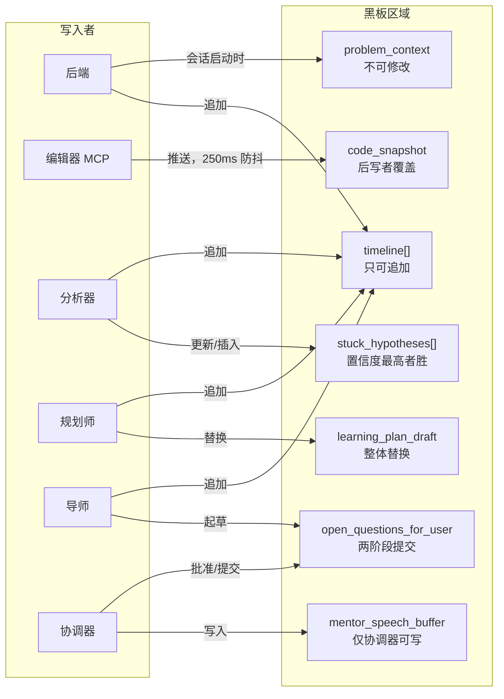
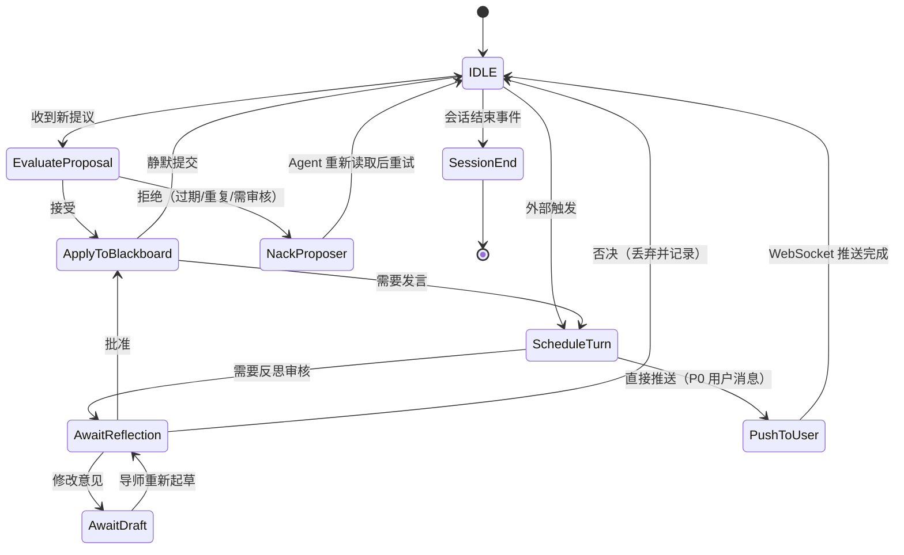
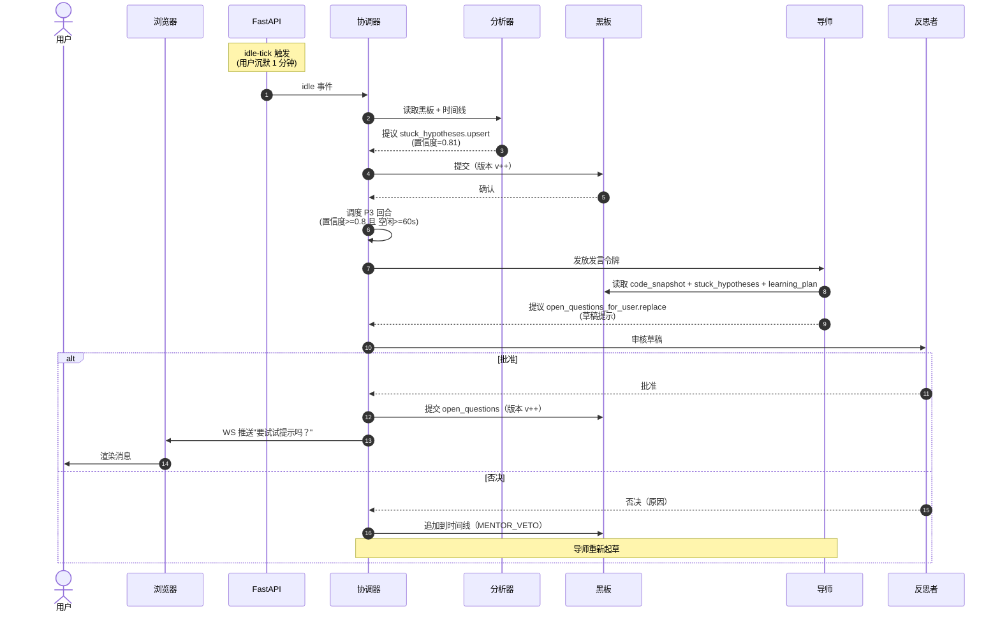
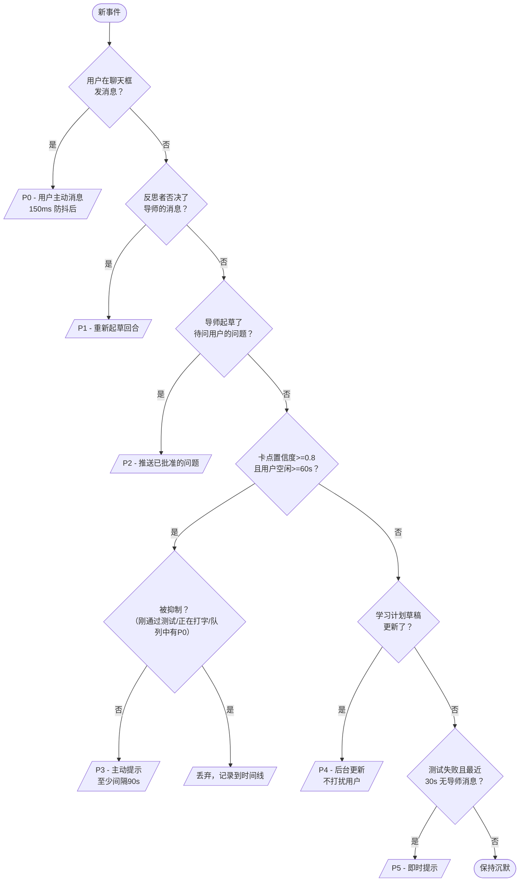

# 架构 C：黑板 + 协调器 工作流详解

> 本文档是 `AGENT_ARCHITECTURE.md` 第三部分的配套文档，深入讲解**黑板 + 协调器**模式在实际编程会话中是如何运转的：生命周期、消息流程、状态机、冲突解决、延迟预算、错误处理。
>
> 推荐阅读顺序：先读 §1（概览图），再读 §5（完整会话流程），最后按需深入各技术章节。

---

## 一句话理解这个架构

> 想象一个教室里的"学习分析白板"。每个学生（Agent）不能在白板上随意写字——他们要举手（Proposal）、等老师（Coordinator）批准后才能写。而且每个学生写的都会被记录（Timeline），老师的发言（Mentor）要经过助教（Reflection）审核才能说出口。

---

## §1 整体架构一览

### 1.1 系统全貌（文字版）

```
                      ┌──────────────────────────────────────────┐
                      │               用户浏览器                    │
                      │   [ 代码编辑器 ]              [ 聊天面板 ]   │
                      └──────────────┬─────────────────────┬───────┘
                                     │ WS 事件流            │ WS 消息流
                                     ▼                      ▲
                      ┌──────────────────────────────────────────┐
                      │              FastAPI 网关                 │
                      │      负责鉴权、限速、WebSocket 会话管理     │
                      └────────────────────┬───────────────────┘
                                            │
                                            ▼
                        ╔════════════════════════════════════╗
                        ║           协 调 器（Coordinator）  ║    ┌──────────────────┐
                        ║  • 状态机调度                       ║◀───│  反思者（Reflection）│
                        ║  • 发言令牌管理                     ║    │  只读，可否决       │
                        ║  • 冲突策略                         ║    └──────────────────┘
                        ╚════╤═══════════════╤═══════════════╝
                             │               │               │
                        提议/读写          提议/读写        提议/读写
                             ▼               ▼               ▼
                        ┌──────────┐   ┌──────────┐   ┌──────────┐
                        │  导师     │   │  分析器  │   │ 规划师  │
                        │ Mentor   │   │ Analyzer │   │ Planner  │
                        └─────┬────┘   └─────┬────┘   └─────┬────┘
                              │               │               │
                              └───────────────┴───────────────┘
                                              │
                                              ▼
                              ┌──────────────────────────────┐
                              │           黑 板（Blackboard）   │
                              │   每个会话独立，版本化存储       │
                              │  • problem_context（题目上下文）   │
                              │  • code_snapshot（代码快照）      │
                              │  • timeline[]（时间线，仅追加）    │
                              │  • stuck_hypotheses[]（卡点假设） │
                              │  • learning_plan_draft（学习计划）│
                              │  • open_questions_for_user       │
                              │  • mentor_speech_buffer           │
                              └──────────────────────────────┘
                                              │
                                              ▼
                              ┌──────────────────────────────┐
                              │        MCP 工具层（只读）        │
                              │  problems / execution /         │
                              │  user / editor / curriculum     │
                              └──────────────────────────────┘
```

### 1.2 六个 Mermaid 图（可在 GitHub / VSCode / GitLab 中直接渲染）

#### 1.2.1 系统架构图

```mermaid
flowchart TB
    User([用户浏览器])
    Editor[Editor MCP]
    ExecMCP[Execution MCP]
    Gateway[/FastAPI 网关<br/>鉴权、限速、WebSocket/]
    Coordinator{{"协调器<br/>(状态机)"}}
    Reflection{{"反思者<br/>(只读、可否决)"}}
    Mentor[/"导师<br/>(读写黑板)"/]
    Analyzer[/"分析器<br/>(读写黑板)"/]
    Planner[/"规划师<br/>(读写黑板)"/]
    subgraph Blackboard["黑板（每个会话独立）"]
        BB_Ctx["problem_context<br/>题目上下文（不变）"]
        BB_Code["code_snapshot<br/>代码快照"]
        BB_Time["timeline[]<br/>时间线（仅追加）"]
        BB_Stuck["stuck_hypotheses[]<br/>卡点假设"]
        BB_Plan["learning_plan_draft<br/>学习计划草稿"]
        BB_Open["open_questions_for_user<br/>待问用户的问题"]
        BB_Speech["mentor_speech_buffer<br/>导师发言缓冲区"]
    end
    MCP[("MCP 工具层<br/>problems / execution /<br/>user / editor / curriculum")]
    User <-->|WS 事件 / 聊天| Gateway
    Editor -->|代码事件| Gateway
    ExecMCP -->|测试结果| Gateway
    Gateway -->|发布事件| BB_Time
    Gateway -->|推送代码| BB_Code
    Mentor <-->|提议/读写| Coordinator
    Analyzer <-->|提议/读写| Coordinator
    Planner <-->|提议/读写| Coordinator
    Coordinator -->|发放发言令牌| Mentor
    Coordinator <-->|否决/批准| Reflection
    Mentor -->|提议问题| Coordinator
    Coordinator -->|提交| BB_Open
    Coordinator -->|提交| BB_Stuck
    Coordinator -->|提交| BB_Plan
    Mentor -. 读取 .-> BB_Time
    Analyzer -. 读取 .-> BB_Time
    Planner -. 读取 .-> BB_Time
    Mentor <-->|调用| MCP
    Analyzer <-->|调用| MCP
    Planner <-->|调用| MCP
    Coordinator -->|广播版本更新| Mentor
    Coordinator -->|广播版本更新| Analyzer
    Coordinator -->|广播版本更新| Planner
    Gateway -->|推送消息| User
    classDef agent fill:#1f6feb,stroke:#0b3d91,color:#fff
    classDef coord fill:#d29922,stroke:#7d5a00,color:#000
    classDef store fill:#238636,stroke:#0a3d1c,color:#fff
    classDef io fill:#6e7681,stroke:#3a3f47,color:#fff
    classDef external fill:#8957e5,stroke:#5a3a9c,color:#fff
    class Mentor,Analyzer,Planner agent
    class Coordinator,Reflection coord
    class BB_Ctx,BB_Code,BB_Time,BB_Stuck,BB_Plan,BB_Open,BB_Speech store
    class Gateway,MCP io
    class User,Editor,ExecMCP external
```




#### 1.2.2 写权限图（谁能往哪个区域写字）




#### 1.2.3 协调器状态机




#### 1.2.4 序列图："用户卡住 1 分钟"




#### 1.2.5 发言令牌优先级流程（P0–P5）




#### 1.2.6 何时使用哪张图


| 图            | 最佳使用场景           |
| ------------ | ---------------- |
| §1.2.1 系统全貌  | 架构评审、README、设计文档 |
| §1.2.2 写权限   | 代码审查中说明"谁可以改什么"  |
| §1.2.3 状态机   | 调试协调器行为          |
| §1.2.4 序列图   | 走通一个具体用户场景       |
| §1.2.5 令牌优先级 | 理解抑制规则           |


六张图均可在 **GitHub、GitLab、VSCode（需 Mermaid 插件）、Obsidian、Notion** 中直接渲染，无需额外工具。

---

## §2 黑板：数据如何存放

### 2.1 黑板是什么

黑板是**每个会话独有一份、版本化的结构化文档**。它像一块真正的白板——每个 Agent 不能直接冲上去写字，必须先举手（提议），协调器批准后才能写。已写入的内容永远保留（有版本号），时间线永远只追加、不覆盖。

### 2.2 七个区域及其写入规则


| 区域                        | 内容                | 谁可以写           | 写入规则                            | 谁在读        |
| ------------------------- | ----------------- | -------------- | ------------------------------- | ---------- |
| `problem_context`         | 题目信息（标题、描述、示例、约束） | 后端（会话启动时）      | **不可修改**                        | 所有人        |
| `code_snapshot`           | 用户当前代码 + 光标位置     | 编辑器 MCP（推送）    | **后写者覆盖**，250ms 防抖              | 所有人        |
| `timeline[]`              | 所有事件的时间线          | 所有参与者          | **仅追加**，永不覆盖                    | 所有人        |
| `stuck_hypotheses[]`      | 分析器认为用户卡在哪里的假设    | 分析器            | **最高置信度胜出**，旧假设标记为 `superseded` | 导师、协调器、反思者 |
| `learning_plan_draft`     | 规划师制定的学习计划       | 规划师           | **整块替换**（原子操作）                  | 协调器、导师     |
| `open_questions_for_user` | 导师想问用户的问题         | 导师（起草），反思者（审核） | **两阶段提交**                       | 前端、导师      |
| `mentor_speech_buffer`    | 导师即将说出的话          | **仅协调器**       | **唯一写入者**                       | 导师         |


### 2.3 版本号机制

每个区域都有独立的版本号（单调递增）。写入采用**乐观锁**——如果提议时的基础版本与当前版本不一致，说明有人在这期间改了，提议被拒绝，发起者需要重新读取后再次提议。

```jsonc
// 会话 sess_abc 黑板在 version = 47 时的状态
{
  "session_id": "sess_abc",
  "version": 47,
  "sections": {
    "problem_context":  { "v": 1,  "data": { /* 不可变 */ } },
    "code_snapshot":    { "v": 42, "data": { "language": "python", ... } },
    "timeline":         { "v": 47, "data": [ /* 47 条事件 */ ] },
    "stuck_hypotheses": { "v": 7,  "data": [
        { "id": "h3", "claim": "右指针 off-by-one", "confidence": 0.81, "status": "active" },
        { "id": "h2", "claim": "缺少空输入的 base case", "confidence": 0.42, "status": "superseded" }
    ]},
    "learning_plan_draft": { "v": 2, "data": { /* ... */ } },
    "open_questions_for_user": { "v": 0, "data": { "questions": [] } },
    "mentor_speech_buffer": { "v": 11, "data": { "pending": null, "suppressed_count": 0 } }
  }
}
```

### 2.4 时间线：系统的心跳记录

时间线是整个系统的"黑匣子"。**任何来源发生的任何事件都会被追加到这里**，包括：

- `SESSION_STARTED` — 会话开始
- `CODE_EDITED` — 用户编辑了代码
- `TEST_RUN` — 用户运行了测试
- `MENTOR_QUESTION_PUSHED` — 导师的消息被推送给用户
- `MENTOR_VETO` — 导师的草稿被否决
- `HYPOTHESIS_PROPOSED` — 分析器提出了新假设

这一条记录链使得系统**完全可回放**（见 §7）和**完全可解释**。

---

## §3 协调器：系统的交通警察

### 3.1 协调器是什么

协调器是一个**小型、确定性、无 LLM 的状态机**。它只做三件事：

1. **接收或拒绝** Agent 的提议（根据区域的写入规则）
2. **发放发言令牌**（同一时间只有一个 Agent 能和用户说话）
3. **抑制** 过时或自相矛盾的导师输出

### 3.2 什么是"发言令牌"

**发言令牌（Speaking Token）**是整个系统防止"多 Agent 同时说话"的机制。

想象一个会议室里有三个顾问（导师、分析器、规划师），用户坐在中间。如果三个人同时对用户说话，用户会完全听不懂。所以会议室有一条规则：**同一时间只有一个人有发言权**，其他人只能写便签给这个人，由他决定说什么、什么时候说。

发言令牌就是这个"发言权"。

- 只有持有令牌的 Agent 才能起草面向用户的消息
- 没有令牌的 Agent 只能：读取黑板 → 向协调器发提议 → 等待令牌
- 令牌是**排他**的：发给一个人，其他人必须等

为什么不能并发发言？因为导师、分析器、规划师对同一件事可能有不同的判断。并发说出两个矛盾的建议会让用户困惑。必须串行化，由协调器按优先级决定"现在谁说"。

### 3.3 什么是"导师起草了问题"

**导师起草了问题**，指的是导师在获得发言令牌后，会起草一条**面向用户的提示或问题**（比如"要试试提示吗？"或"你好像在边界情况卡住了，第 18 行的逻辑有没有检查过？"）。

这条消息不会直接发给用户。它要先经过**两阶段提交**：

```
导师起草 → 提交给协调器 → 协调器发给反思者审核
    │
    ├── 批准 → 提交黑板 → WebSocket 推送给用户
    ├── 修改意见 → 发回导师重新起草
    └── 否决 → 丢弃，记录原因到时间线
```

"导师起草了问题"就是指这条消息经过了起草这一步。"且反思者批准了"是指这条消息已经通过了审核，可以发给用户了。P2 这个优先级存在的意义是：用户的屏幕只会显示一条消息，不会有两条导师消息挤在一起。

### 3.4 状态机一览

```
               ┌──────────────────┐
               │      空闲         │◀──────────────────────────┐
               │（无待处理提议，    │                           │
               │  无发言令牌）      │                           │
               └────────┬─────────┘                           │
                       │ 收到新事件                            │
                       ▼                                      │
         ┌─────────────────────────────┐                      │
         │        评 估 提 议           │                      │
         │  • 检查写入权限              │                      │
         │  • 检查版本是否过期          │                      │
         └──────┬──────────────┬───────┘                      │
         接受   │              │ 拒绝                          │
                ▼              ▼                               │
  ┌──────────────────┐  ┌──────────────────┐                   │
  │   提 交 到 黑 板  │  │    否 决 提 议   │ ──重新读取后重试─┘
  │  （版本号递增）   │  │  （附上拒绝原因）  │
  └────────┬─────────┘  └──────────────────┘
           │
           │ 如果提议需要发言
           ▼
  ┌──────────────────┐
  │   安 排 发 言     │  优先级 = f(区域类型, 置信度, 年龄)
  │  （发放令牌）     │  受"最小间隔"规则限制
  └────────┬─────────┘
           │
           ▼
  ┌──────────────────┐
  │   等 待 审 核     │  （仅当需要反思审核时）
  └──────┬───────┬─────┘
   通过   │       │ 否决 → 回到"导师重新起草"
         ▼
  ┌──────────────────┐
  │   推 送 给 用 户   │  → 通过 WebSocket 发出
  └────────┬─────────┘
           │
           └────────────── 会话生命周期事件 ──▶  会话结束
```

### 3.5 发言令牌的优先级（P0 最高）

协调器发放令牌的顺序是固定的，优先级从高到低：


| 优先级    | 触发条件                             | 说明                     |
| ------ | -------------------------------- | ---------------------- |
| **P0** | **用户在聊天框发消息**                    | **始终授权**，150ms 防抖后立即发放 |
| P1     | 反思者否决了导师的草稿                      | 导师需要重新起草时              |
| P2     | 导师起草了问题，且反思者批准了                  | 推送已批准的问题               |
| P3     | 分析器的假设置信度 ≥ 0.8 **且**用户空闲 ≥ 60 秒 | 有频率限制：两条主动提示至少间隔 90 秒  |
| P4     | 规划师的学习计划草稿更新了                     | 仅在会话结束或用户打开"练习"页面时触发   |
| P5     | 测试失败 **且**最近 30 秒没有导师消息          | 即时提示                   |


**P3（主动提示）会被抑制（不发出）如果：**

- 用户在最近 15 秒内通过了测试
- 用户正在打字（最近 5 秒有按键）
- P0 请求已在队列中
- 上一次 P3 推送距今不到 90 秒

---

## §4 提议协议：Agent 之间如何通信

### 4.1 为什么不能直接写

每个 Agent **不能直接改黑板**。必须先向协调器发一个"提议"（Proposal），协调器验证后才会提交。这是为了防止两个 Agent 同时写入造成冲突。

### 4.2 提议的格式

```jsonc
{
  "proposal_id":   "p_8f3a",
  "session_id":    "sess_abc",
  "from":         "analyzer",              // 谁发起的
  "section":      "stuck_hypotheses",       // 目标区域
  "base_version": 6,                       // 我读取时的版本号
  "operation":    "upsert",                 // 操作类型
  "payload": {
    "id": "h3",
    "claim": "右指针 off-by-one",
    "confidence": 0.81,
    "evidence": ["第14-18行 90秒内修改了6次", "测试用例7、9在边界情况失败"]
  },
  "rationale":   "用户在同一个代码块反复修改",
  "ts":          "2026-06-14T15:32:11.482Z"
}
```

### 4.3 协调器的审核逻辑（伪代码）

```python
def evaluate(proposal: Proposal) -> Decision:
    section = proposal.section
    current_version = blackboard[section].version
    policy = SECTION_POLICIES[section]

    # 1. 版本检查：如果我读取的版本已经过期，直接拒绝
    if proposal.base_version != current_version and policy.requires_strict_versioning:
        return Decision.NACK_REBASE  # "请重新读取后再试"

    # 2. 区域特殊规则
    if section == "stuck_hypotheses":
        # 如果已有更高置信度的活跃假设，新假设只能作为"候选"
        if any(h.confidence >= proposal.payload.confidence and h.status == "active"
               for h in blackboard["stuck_hypotheses"].data):
            proposal.payload.status = "candidate"
        # 如果完全重复，拒绝
        if any(h.claim == proposal.payload.claim for h in blackboard["stuck_hypotheses"].data):
            return Decision.NACK_DUPLICATE

    if section == "open_questions_for_user":
        if not coordinator.reflection_required_ok_for(proposal):
            return Decision.NACK_NEEDS_REFLECTION  # 需要先经过反思者

    return Decision.COMMIT  # 批准！
```

### 4.4 两阶段提交：导师的消息如何审核

导师的每一条面向用户的消息都必须经过反思者（Reflection）审核才能发出。这个流程叫"两阶段提交"：

```
导师  ──起草──▶  协调器
                    │
                    ▼
               反思者审核
                    │
         ┌──────────┼──────────┐
         ▼          ▼          ▼
      批准         修改意见     否决
         │          │           │
         ▼          ▼           ▼
      提交       发回导师      丢弃，
               重新起草      记录到时间线
```

**否决的原因会被记录**（可审计）：

- `non-spoiler-violation` — 泄露了完整解题答案
- `unsafe-content` — 不安全内容
- `redundant-with-recent-message` — 和最近的消息重复
- `low-confidence-hypothesis` — 基于置信度太低的假设

---

## §5 一个完整会话的五个阶段

这是整个架构最重要的部分——一个真实的编程会话从头到尾发生了什么。

```
┌────────┐   ┌──────────┐   ┌──────────┐   ┌──────────┐   ┌────────┐
│  启动   │──▶│   读题   │──▶│   做题   │──▶│   复盘   │──▶│  结束  │
└────────┘   └──────────┘   └──────────┘   └──────────┘   └────────┘
  ~1秒        5~30秒         5~60分钟        30~90秒         ~2秒
```

### 阶段一：启动（Session Start）

1. 用户点击"开始做题 #42"
2. FastAPI 网关在 Postgres 创建会话记录，初始化黑板：
  - `problem_context` ← 从 MCP 获取题目信息
  - `code_snapshot` ← 起始代码模板
  - `timeline[0]` ← `{kind: SESSION_STARTED}`
3. 从用户画像（L3 存储）加载：知识点掌握度、最近的卡点记录、偏好的语气
4. 协调器初始化状态：`speaking_token = null`，`reflection_required = true`
5. 导师拿到 P2 令牌，起草一句基于题目和用户画像的问候语
6. 反思者批准 → 推送给用户

### 阶段二：读题（Read / Explore）

用户在看题目、翻示例，心里推演解法。**所有 Agent 保持沉默**。

- 编辑器 MCP 记录用户的光标移动和选区变化 → 时间线
- 分析器安静等待（还没有"卡住"的信号）
- 导师安静等待（只有用户主动发消息才响应）
- 规划师悄悄预计算一份学习计划草稿（但不写出）

### 阶段三：做题（Solve）—— 核心阶段 ⭐

这是整个系统发挥价值的地方。用户做一件事，其他所有 Agent 自动联动：

**当用户编辑代码时：**

```
编辑器 MCP 防抖 250ms → code_snapshot 更新（版本++）
```

**当分析器发现用户可能卡住了：**

```
分析器 → 协调器（提议 stuck_hypotheses.upsert）
协调器 → 检查置信度 ≥ 0.8 且 用户空闲 ≥ 60 秒？
  → 是 → 发放 P3 令牌给导师
  → 否 → 暂时存入黑板，等待下一次事件
导师（拿到令牌）→ 读取 code_snapshot + stuck_hypotheses + learning_plan
导师 → 起草一个简短的问题
导师 → 协调器（提议 open_questions_for_user.replace）
协调器 → 反思者审核
  → 批准 → 提交，WebSocket 推送给用户
  → 否决 → 记录原因，导师重新起草
```

**当用户在聊天框发消息时：**

```
FastAPI → 协调器（chat.message 事件）
协调器 → 立即发放 P0 令牌给导师（最高优先级，永不抑制）
导师 → 读取时间线 + 黑板 → 起草回复
协调器 → 反思者审核 → 推送
```

### 阶段四：复盘（Review）—— 用户提交答案后

1. 用户点击"提交"，测试框架返回完整结果
2. 协调器发放 P0 令牌给导师
3. 导师读取时间线 + 最终代码 + 测试结果
4. 导师输出两段式复盘：
  - 第一段：哪些地方做得好
  - 第二段：下次可以改进的一个具体方向（基于假设日志）
5. 规划师获得 P4 令牌（后台，不打扰用户），更新 `learning_plan_draft`
6. 两者均通过反思者审核 → 推送复盘；更新用户画像中的知识点掌握度
7. 前端展示"下次练习"卡片

### 阶段五：结束（Session End）

1. 用户关闭标签页 / 点击"结束会话" / 空闲超过 30 分钟
2. 协调器在时间线写入 `SESSION_ENDED`
3. 规划师最终确定学习计划（原子替换）
4. 调用 `user-mcp.update_mastery(...)` 更新每个受影响的知识点
5. 黑板归档到冷存储（Postgres），供回放使用
6. WebSocket 关闭

---

## §6 最关键流程详解："用户卡住 1 分钟"

```
用户        浏览器       FastAPI      协调器       分析器       导师        反思者       黑板
 │             │             │            │            │          │            │           │
 │  （空闲）    │             │            │            │          │            │           │
 │             │             │            │            │          │            │           │
 │             │             │  idle-tick │            │          │            │           │
 │             │             │───────────▶│            │          │            │           │
 │             │             │            │  读取黑板   │          │            │           │
 │             │             │            │────────────┼────────────────────▶│           │
 │             │             │            │            │          │            │           │
 │             │             │            │  提议 stuck_hypotheses.upsert  │           │
 │             │             │            │◀───────────┼──────────────────│           │
 │             │             │            │            │          │            │           │
 │             │             │            │  提交（版本++）│           │            │           │
 │             │             │            │────────────────────────────────────────────────▶  v++
 │             │             │            │            │          │            │           │
 │             │             │            │  调度 P3 回合       │            │           │
 │             │             │            │───────────▶│ 令牌     │            │           │
 │             │             │            │            │          │            │           │
 │             │             │            │  读取黑板   │          │            │           │
 │             │             │            │────────────────────────▶│            │           │
 │             │             │            │            │          │            │           │
 │             │             │            │  提议 open_questions.replace │         │           │
 │             │             │            │◀────────────────────────│           │           │
 │             │             │            │  发给反思者审核 │         │            │           │
 │             │             │            │─────────────────────────┼──────────▶│           │
 │             │             │            │            │          │            │           │
 │             │             │            │  批准       │          │            │           │
 │             │             │            │◀────────────────────────┼────────────│           │
 │             │             │            │            │          │            │           │
 │             │             │            │  提交（版本++）│           │            │           │
 │             │             │            │────────────────────────────────────────────────▶  v++
 │             │             │            │            │          │            │           │
 │             │  WS 推送    │             │            │          │            │           │
 │◀────────────┼────────────│             │            │          │            │           │
 │  "要试试    │             │             │            │          │            │           │
 │   提示吗？" │             │             │            │          │            │           │
```

**端到端延迟目标：从"空闲计时器触发"到"用户看到消息"≤ 1.5 秒**

---

## §7 可回放性：时间线是最有价值的数据

因为每个事件都被记录在时间线中，每个黑板区域都有版本号，我们可以：

1. **复现导师的决策**：给定某个时刻的时间线和黑板快照，问："当时导师会怎么说？"用不同的 LLM 或不同的反思策略重新跑一遍，看结果是否不同。
2. **对比两个会话**："在 #42 题中，那些在 90 秒内收到'右指针 off-by-one'提示的用户，下一次尝试的通过率是 2.3 倍。"这是最核心的 analytics 原语。
3. **A/B 测试策略**：换掉协调器的优先级函数，用历史时间线跑一遍模拟，比较令牌发放分布。
4. **离线训练规划师**：用历史学习计划草稿 + 用户后续的实际表现，构成一个干净的监督学习数据集。

回放入口（伪代码）：

```python
def replay(session_id: str, up_to_ts: datetime,
           coordinator: CoordinatorStub,
           mentor_model: str,
           reflection_policy: str):
    timeline, bb = load_snapshot(session_id, up_to_ts)
    sim = Simulator(timeline, bb, coordinator, mentor_model, reflection_policy)
    return sim.run()  # 返回最终黑板 + 第一条导师消息
```

---

## §8 错误处理：十种真实可能出现的故障


| 编号  | 故障                     | 如何发现                                | 如何恢复                                  |
| --- | ---------------------- | ----------------------------------- | ------------------------------------- |
| F1  | 分析器 LLM 幻觉了一个卡点假设      | 反思者审核导师消息时捕获症状；协调器有 `置信度 ≥ 0.5` 过滤器 | 假设标记为 `candidate`，不发放 P3 令牌，记录到时间线    |
| F2  | 导师起草了泄题内容（完整答案）        | 反思者的防泄题规则                           | 否决，导师重新起草为问题形式                        |
| F3  | 协调器在提议中途崩溃             | 提议 5 秒超时                            | 进行中的提议标记为 `failed`，各 Agent 重新读取黑板后重提  |
| F4  | WebSocket 断开           | 后端心跳 3 次无响应                         | 会话标记为 `paused`，新连接恢复到上一个黑板版本          |
| F5  | 两个 Agent 同时写同一区域       | 乐观版本检查                              | 后写者收到 `NACK_REBASE`，重新读取后重提           |
| F6  | 黑板写入成功但反思者超时           | 反思者超时 3 秒                           | 协调器临时跳过反思审核（可配置），记录警告日志               |
| F7  | 用户中途愤怒退出               | 空闲 > 30 分钟                          | 进入阶段五：归档黑板                            |
| F8  | LLM 服务商故障              | 所有 Agent 调用均失败（有重试退避）               | 切换降级模式：关闭主动提示，仅响应直接问答                 |
| F9  | 黑板数据不一致（如假设引用了已被替换的题目） | 每次提交时运行校验器                          | 拒绝提交；Agent 收到 `quarantined` 通知；标记人工介入 |
| F10 | 回放结果与原始记录不一致           | 离线 diff 任务                          | 这说明模型发生了漂移，在监控面板中标记                   |


### 8.1 优雅降级阶梯

系统设计为逐级降级，每级都可观测：

```
等级 0  全部正常运作
          │（LLM 服务商变慢）
          ▼
等级 1  跳过反思审核（更快，风险更高）—— F8
          │（协调器宕机）
          ▼
等级 2  导师绕过协调器直接读黑板、写入—— F3
          │（黑板宕机）
          ▼
等级 3  降级为架构 A 模式（直接 ReAct 循环，无协调）—— 最后手段
          │
          ▼
等级 4  显示该题目的常见卡点（静态提示库）—— 完全离线兜底
```

---

## §9 延迟预算

对于"用户主动发消息"这条最常见路径，p95 目标延迟：


| 步骤                  | 预算         | 说明         |
| ------------------- | ---------- | ---------- |
| WebSocket → FastAPI | 30 ms      | 进程内        |
| L1 工作内存从 L2 加载      | 30 ms      | Redis 读取   |
| 导师 LLM 调用（流式）       | 1200 ms    | 70B 级模型    |
| 工具调用（1~3 个，多为 MCP）  | 300 ms     | 并行执行       |
| 反思审核                | 250 ms     | 可以用更小的分类模型 |
| L2 写入               | 20 ms      |            |
| WebSocket 推送        | 50 ms      |            |
| **总计 p95**          | **~1.7 秒** | 在"感觉即时"范围内 |


**关键缓存策略：**

- `problem_context` 和 `user_profile` 在会话启动时预加载到每个 Agent 的 L1 工作内存，**永不重复拉取**
- `stuck_hypotheses` 数据量很小（≤ 5 个活跃项），重读是 O(1)
- 反思者可以用**更小的模型**（如 7B 分类器），它不需要生成文本，只需判断"是/否/为什么"

---

## §10 可观测性：必须监控什么


| 指标                                        | 来源   | 用途                |
| ----------------------------------------- | ---- | ----------------- |
| `proposal_latency_ms{from, section}`      | 协调器  | 发现慢 Agent         |
| `proposal_accept_rate{from, section}`     | 协调器  | 发现行为异常的 Agent     |
| `mentor_token_wait_ms{priority}`          | 协调器  | 发现令牌饥饿（某优先级长期等不到） |
| `reflection_veto_rate{reason}`            | 反思者  | 发现糟糕的提示词          |
| `mentor_msg_user_reaction`（用户点赞/点踩）       | 前端   | 质量信号              |
| `blackboard_section_versions{session_id}` | 黑板   | 发现版本号异常增长         |
| `replay_drift_rate`                       | 离线任务 | 发现模型漂移            |


**追踪要求（OpenTelemetry）：**

- 每条 `提议 → 提交 → 令牌 → 推送` 链路一条追踪
- 每次回放任务一条追踪

---

## §11 映射到现有 FastAPI 项目结构


| 文档中的概念       | 对应文件                                                       |
| ------------ | ---------------------------------------------------------- |
| FastAPI 网关   | `src/main.py`（已有） + `src/api/sessions.py`（新建）              |
| WebSocket 端点 | `src/api/ws.py`（新建）                                        |
| 黑板存储         | `src/services/blackboard/store.py` + `src/db/models.py` 扩展 |
| 协调器状态机       | `src/services/blackboard/coordinator.py`                   |
| 提议协议         | `src/services/blackboard/proposal.py`                      |
| 导师 Agent     | `src/services/agents/mentor.py`                            |
| 分析器 Agent    | `src/services/agents/analyzer.py`                          |
| 规划师 Agent     | `src/services/agents/planner.py`                          |
| 反思者 Agent    | `src/services/agents/reflection.py`                        |
| MCP 客户端      | `src/services/mcp/`（每个服务一个文件）                              |
| 回放工具         | `src/services/replay/simulator.py`                         |
| 健康检查 / 降级模式  | `src/api/health.py`                                        |
| 测试           | `tests/blackboard/`、`tests/agents/`、`tests/e2e/`           |


现有代码**全部保留**，`src/main.py`、计划中的 `src/api/submissions.py`、空的 `src/services/ai_agent.py` 都有自然的归宿。黑板模式是**增加**了结构，不是要求重写。

---

## §12 六周构建计划

按这个顺序来，不会烧光精力：

**第零周——地基（1 周）**

- 定义提议信封格式和黑板区域目录
- 实现 `BlackboardStore`（Postgres JSONB）、`Proposal` 和 `Coordinator`，**只需**接入 `code_snapshot` 和 `timeline` 两个区域
- 一个简单"导师"——只是回显用户说的话

**第一周——单 Agent 循环（1 周）**

- 接入分析器（带 LLM 调用），向 `stuck_hypotheses` 写入
- 协调器发放 P3 令牌；导师把假设转化成一个问题
- 反思者用桩（stub）——永远批准，让循环先跑通

**第二周——真实的反思者（1 周）**

- 把反思者桩替换为真正的 LLM 检查（防泄题、语气、安全）
- 实现 `open_questions_for_user` 的两阶段提交

**第三周——规划师入局（1 周）**

- 规划师接入时间线读取和 `learning_plan_draft` 写入
- 在会话结束时展示"下次练习"卡片

**第四周——回放 + 可观测性（1 周）**

- 构建回放模拟器（§7）
- 接入 OpenTelemetry、§10 中的指标和 `/health` 端点

**第五周——降级模式（1 周）**

- 实现优雅降级阶梯（§8.1）
- 用 LLM 服务商的错误注入做负载测试

**第六周——调优 + 上线准备（1 周）**

- 延迟调优（流式输出、提示词缓存）
- 端到端测试
- 监控仪表板

**总计：约 6 周**一个可工作、可观测、可回放的架构 C。

---

## §13 你需要回答的开放问题

这些不是设计障碍，但会影响实现：

1. **你的 LLM 服务商是谁？** 支持流式输出 + 工具调用吗？延迟预算是按流式计算的。
2. **Postgres JSONB 够用吗，还是需要 Redis？** JSONB 对 v1 足够；如果 p95 延迟预算紧张了再迁移。
3. **你的产品里"泄题"的标准是什么？** 编程面试工具和儿童编程 app 的阈值完全不同。
4. **反思者的否决需要有"人在回路"吗？** 受监管产品可能需要"导师消息经人工批准"的模式。
5. **黑板归档的保留策略是什么？** 冷存储增长很快，需要设定 TTL。

---

## §14 五句话总结

- **黑板是一块版本化的、分区的、每个会话一份的白板。** 追加式时间线 + 命名区域。
- **协调器是一个小型状态机（无 LLM）。** 它接受/拒绝提议，发放发言令牌。
- **每个 Agent 都是"读取 → 思考 → 提议 → 等待"的循环。**
- **反思者是用户能看到的所有消息的唯一审核关卡。**
- **整个系统完全可回放，因为时间线是唯一的真相来源。**
- **任意组件故障时，系统会优雅降级到架构 A 模式。**

---

**下一步？** 如果你想开始搭建，只需要说一声，我会切换到 Agent 模式，从 `src/services/blackboard/`（store、proposal、coordinator）和四个 Agent 模块开始写代码。